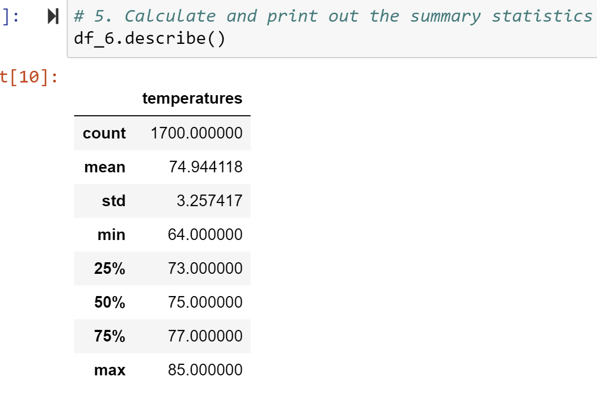
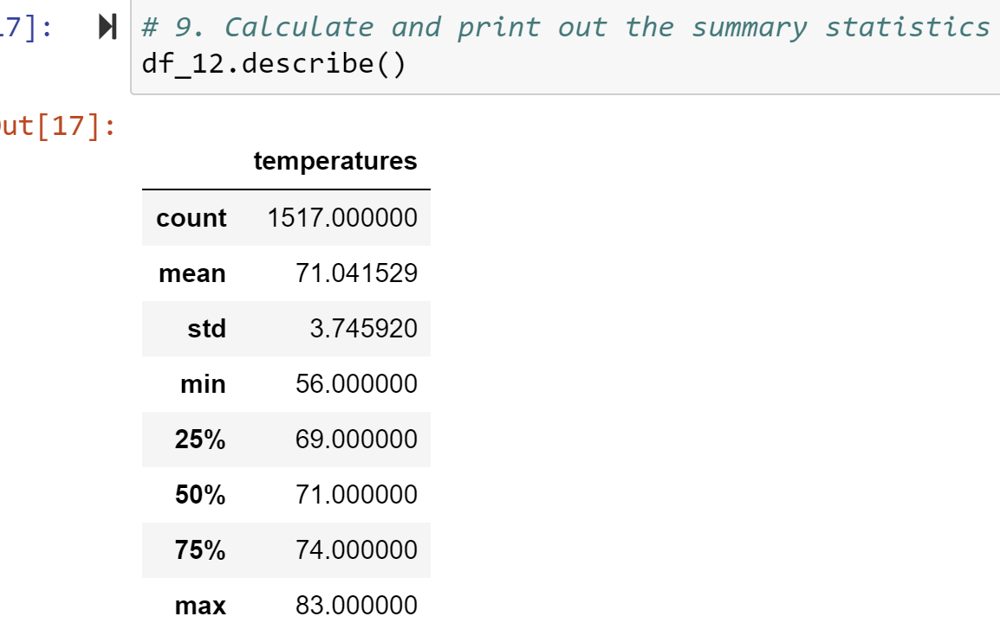
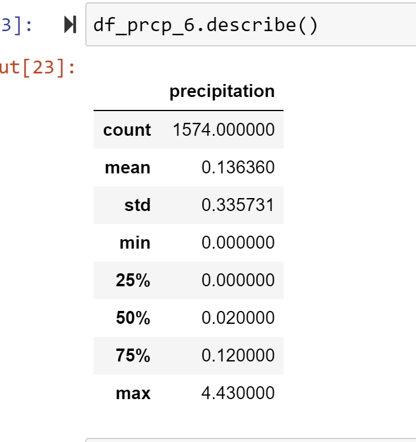
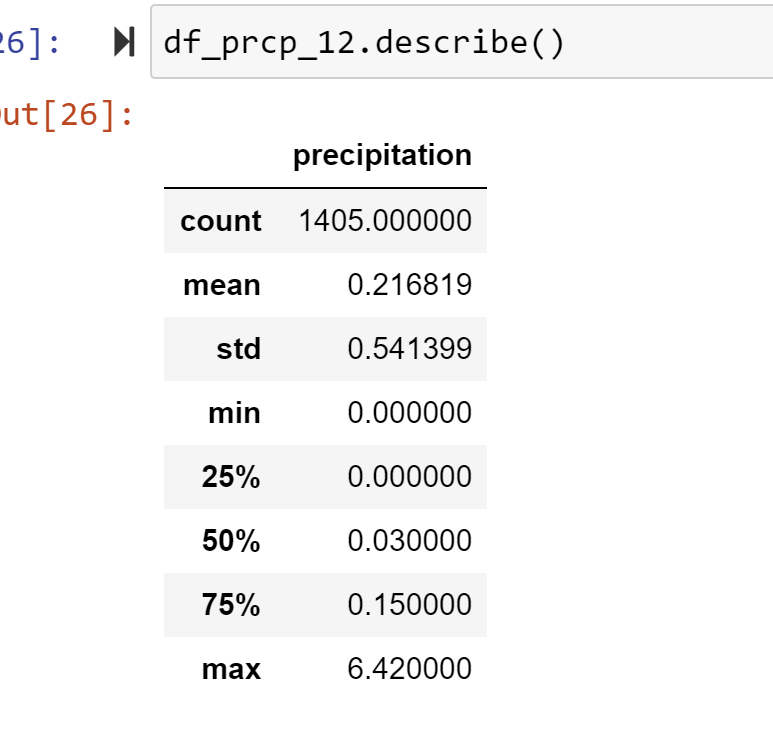
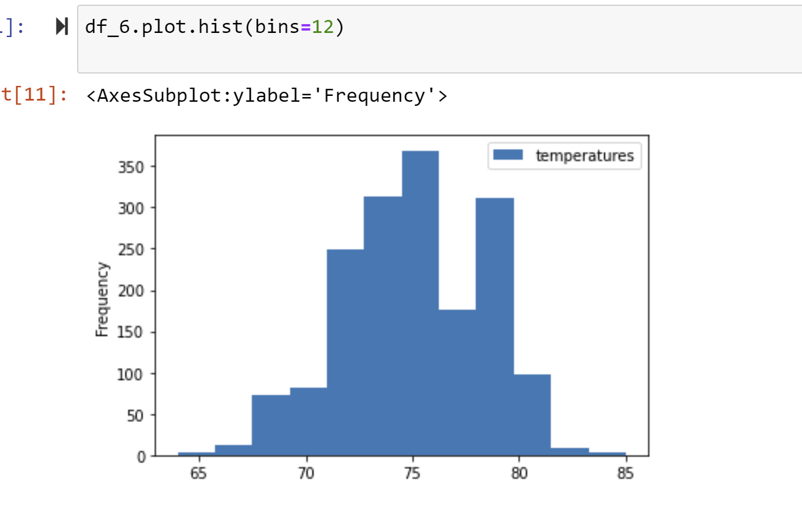
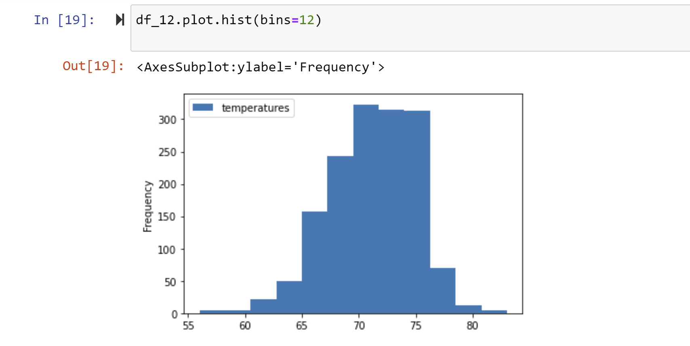
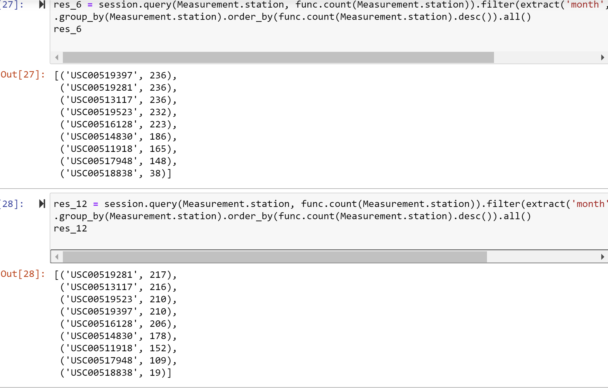

# surfs_up
SQLite, SQLAlchemy, Flask

---

## Overview of the statistical analysis:

The purpose of the analysis is to provide W. Avy with weather information in Oaho so he can decide whether to invest in a surf and icecream shop on the Island. Specifically he is interested to know the temperature data for the months of June and December so he can determine if the surf and ice cream shop business would be sustainable year-round.  

---

## Link to Complete Code

---

## Results:

### June Temperature Statistics

### December Temperature Statistics

The data as seen in the statistics above suggests the following three key differences in weather between June and December:

1. The minimum temperature in December is significantly lower than the minimum temperature in June. December is 56deg and June is 64deg. 

2. The measures of central tendency both mean and also median are about 4 degrees different between June and December. December is 71deg and June is 75deg. 

3. The measures of spread are showing a little more spread for the December data. The interquartile range in December equals 5 degrees. In other words, 50% of the data is between 69 and 74 degrees. Within this data 25% of the data points fall between 69 and 71 degrees and 25% between 71 and 74. In June the IQR is 4 degrees. 50% of the data is between 73 and 77 degrees. 25% between 73 and 75 and 25% between 75 and 77. Standard deviation in June is a little less than the standard deviation for Decmber. June is 3.257 and December is 3.745 This means that the distance of the data points from the mean is slightly farther away in Decmber than in June. There is slightly more variation in temperature.  

---

## Summary:

Based on the results of the this analysis, the temperature in Oaho seems quite similar in June and in December. There are some differences but they are rather small. And in December, the colder month, 75% of the data is above 69 degrees which is quite comfortable. I would suggest that opening a surf and ice scream business would make sense. 
Though I would be interested to learn a couple more things:
1. I would want to know if there is a difference in the amount of rain for June and for December. And based on a new query, as seen below, there is very little precipitation in June and also in December. The difference in precipitation is small. For both June and December the amount of precipitation 75% of the time is 0.12 and 0.15. Beyond the 75% percentile, the max is a little higher in December at 6.42 compared to 4.43 in June. 

#### June Precipitation Statistics

#### December Precipitation Statistics

2. Creating a histogram helps understand the data more thoroughly. It shows the frequency of each temperature measurements so you can get a better understanding of the spread of how often each temperature occurs. For example, it is easy to see that the lowest quartile for December the temperatures are mostly on the higher end of that bracket. So this is encouraging and means that the very low temperatures 65 or below happen a small precentage of the time. The exact percentage could be calculated too. 

#### June Temperature Histogram

#### December Temperature Histogram

3. Other ways to analyze the data could include counting the data for June and December by stations. This shows that the number of data points for station USC00518838 is very low and means that it is not enough data from that stations to draw any conclusions. 

#### Data by Station for June and December

